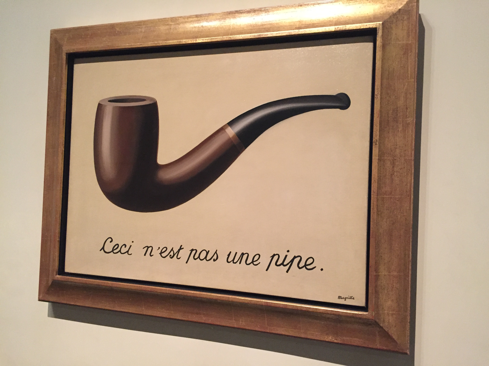

  "La traición de las imagenes" – René Magritte (1929). Fuente: 
  <a href="https://commons.wikimedia.org/wiki/File:Magritte_treachery.jpg" target="_blank" rel="noopener noreferrer" style="color: #999; text-decoration: underline; text-underline-offset: 3px;">
    Wikimedia Commons
  </a>.

---

Quienes me conocen saben que soy una persona que no puede estarse quieta durante mucho tiempo. Me encanta la novedad, lo reconozco, soy un early adopter de manual, lo que se traduce a todas las áreas de mi vida, incluida la música.

Desde hace bastantes años la música que consumo proviene de las famosas listas de recomendados que hace Spotify o de radios con canciones similares a las que me gustan. En contraposición a esto, cuando escucho una canción que me gusta, la repito y la repito hasta que se vuelve algo casi enfermizo.

El problema que tengo últimamente es que desde hace unos meses me siento bastante engañado. Casi todas las canciones que escucho, y sobre todo con las que entro en bucle, resulta que son canciones que han sido generadas por IA.

Cada vez me cuesta más diferenciar entre la máquina y el hombre.

Durante este tiempo he ido “cazando” a varios artistas de este tipo; generalmente se caracterizan por una producción masiva de canciones, por añadir coros y por tener cantantes que son capaces de sostener notas difíciles durante bastantes segundos. Pero siendo completamente sincero, Spotify me la ha colado con un (o una) artista llamado LUNÈS y me ha dejado totalmente patidifuso.

No cumple a priori las características mencionadas con anterioridad. No sube muchas canciones, no tiene una voz que se note que es IA, tiene un estilo bastante poco comercial e incluso tiene portadas que parecen reales.

La gran cuestión aquí, y por ende mi gran dilema, es qué hago una vez descubierto el pastel. Ayer mismo iba en el coche pensando que posiblemente en el famoso resumen del año de diciembre me va a salir este artista como uno de los más escuchados y hoy no puedo más que pensar:

¿Tengo un gusto musical tan básico y tan fácilmente replicable?

¿Por qué Spotify no añade un banner como ya han hecho otras grandes empresas para marcar el contenido generado por IA?

Profundizando en el tema, me he topado con muchos usuarios que comparten mi frustración. El algoritmo de Spotify ha funcionado muy bien durante los últimos años, dándonos canciones que tenían una melodía, un estilo o simplemente un ritmo que encajaba con nuestros gustos (aunque cuando rascas te das cuenta de que solo aparecen artistas que pagan por estar ahí). Incluso añadiendo de vez en cuando algún “descubrimiento” de los de verdad. Una de esas canciones que conseguían enamorarme durante varias semanas, canción que seguramente hubiese descartado de primeras.

Hay diferentes artículos que profundizan en la teoría de que estas IAs las genera la propia Spotify para generar más beneficio y pagar a menos artistas reales.

¿Tienen sentido estas afirmaciones?

Seamos sinceros, el gigante sueco tiene el conocimiento, saben qué canciones funcionan mejor, qué géneros te gustan y, sobre todo, conocen tus gustos musicales. En realidad tienen todos los ingredientes de la receta secreta del éxito. Pueden perfectamente coger toda esa información, entrenar una IA (aunque esto lo hagan a través de terceros) y crear nuevos artistas que generen miles de reproducciones diarias de las que ellos tienen el 100% de los derechos.

Spotify paga a los artistas entre $0,003 y $0,005 por reproducción, siempre que al menos 1.000 usuarios únicos escuchen tu canción más de 1.000 veces durante los últimos 12 meses. Este pequeño detalle parece una tontería, pero si nos fijamos en los datos, se estima que estos pequeños artistas suponen el 80% del total. Además, hay que tener en cuenta que tú no puedes subir una canción directamente a la plataforma, tienes que pasar por una distribuidora que actúa como intermediaria (y se lleva comisión).

El mar de la industria musical es grande, y cada día entran nuevos pezqueñines, pero si la propia empresa genera artistas a medida y les da prioridad en su algoritmo, los artistas reales se diluyen en el vasto océano y nunca llegan a generar ese mínimo de reproducciones que necesitan para poder monetizar.

Es una barrera de entrada creada a medida.

En su reporte, Spotify presume de que cada año más y más artistas se unen a la plataforma, pero cuando miras con lupa fuera de ese reporte, encuentras que ellos mismos tienen un programa interno llamado PFC (Perfect Fit Content) en el que, en su origen hace unos años, presuntamente empezaron a incentivar a los editores de playlists a dar prioridad a música ambiental generada de forma anónima y genérica.

Diversas distribuidoras autorizadas pagaban a los artistas para generar música anónima. El problema es que muchos de esos artistas lo veían como música barata y de poca calidad, un portfolio musical que ahora se ha podido perfectamente usar para entrenar IAs especializadas en generar hits.

Todo esto nos lleva a un ecosistema en el que las canciones generadas por IA se han hecho con el protagonismo, hasta el punto de suplantar a los verdaderos artistas.

Es solo una teoría (Los entresijos de la industria musical dan mucho de sí: https://harpers.org/archive/2025/01/the-ghosts-in-the-machine-liz-pelly-spotify-musicians/).

Pero ¿y si fuese real?

Sería una jugada maestra. Un ejemplo claro de cómo la innovación se puede usar para incrementar exponencialmente los beneficios de una empresa. Al final estás jugando al poker mientras le ves las cartas a tu oponente.

La pregunta está en si es una innovación ética.

Llevamos años hablando de la privacidad y de cómo las empresas recopilan nuestros datos, ya sean las famosas cookies o nuestros hábitos diarios. La información siempre ha sido y será sinónimo de poder; el problema viene cuando la gente se empieza a dar cuenta de cómo las empresas usan esa información.

No hay nada que llevemos peor que sentirnos engañados y relegados a un segundo plano.

En realidad la innovación no es buena o mala, nada es blanco o negro. La cuestión no está en la tecnología en sí, sino en el fin para el que se usa y los límites que se cruzan.

En este caso, creo que Spotify está cruzando unos límites muy peligrosos, ellos o las empresas que estén detrás de potenciar este abanico de canciones generadas de forma artificial, y creo que a la larga les va a pasar factura.

Una innovación no sirve de nada si la gente la asocia con emociones negativas.

Un sentimiento no es más que la unión entre un pensamiento y una emoción.

Si llevas a tus clientes hacia emociones negativas justo cuando están pensando en tu producto, se generan unos sentimientos que automáticamente empiezan a despertar rechazo ante tu innovación.

Esto es lo que está pasándole a mucha gente, y yo personalmente no tengo claro cómo actuar: ¿dejo de escuchar a estos artistas aunque me encanten sus canciones o acepto que el mundo está cambiando y que es luchar contra gigantes?

Para mí es una cuestión de calidad frente a cantidad.

Dejé de escuchar a algunos artistas generados por IA porque todas sus canciones acababan pareciéndose. Este es el verdadero problema de la baja calidad de los datos con los que se han entrenado muchas IAs (y ya ni hablar de que en un futuro no muy lejano estas empezarán a usar ese contenido para retroalimentarse…).

Pero el caso con el que empezaba esta reflexión creo que es diferente, ofrece algo nuevo, algo genuino, quizás porque se parezca mucho a un humano (seguramente hay alguien detrás). Al final ¿qué es la creatividad? ¿Qué es la innovación? ¿Lo que realmente apreciamos es el producto o su autor?

Yo por ahora voy a estar más atento a lo que me recomienda Spotify. Y si no, siempre me quedará Hans Zimmer.

  Enrique Ortega Molina

