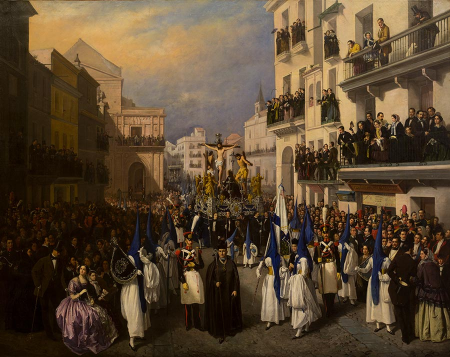

  "Procesión en Sevilla" – Manuel Cabral Aguado-Bejarano (1855). Fuente: 
  <a href="https://upload.wikimedia.org/wikipedia/commons/1/18/Manuel_Cabral_Aguado-Bejarano_-_Procesi%C3%B3n_en_Sevilla%2C_1855.jpg" target="_blank" rel="noopener noreferrer" style="color: #999; text-decoration: underline; text-underline-offset: 3px;">
    Wikimedia Commons
  </a>.

---
Siempre me ha llamado la atención la Semana Santa. Desde cómo la fecha de una celebración tan religiosa se basa en algo tan pagano como las fases lunares, hasta cómo hemos asociado como sociedad la llegada de esta festividad con el fin del invierno y el inicio de la primavera. Pero sobre todo, lo que más me ha sorprendido siempre es la marca invisible que genera la “pasión” con la que tantos fieles viven esta tradición.

Y es que más allá de los pasacalles, trajes y penitentes, la Semana Santa crea un ambiente que invita a reflexionar. Sobre todo en aquellos lugares donde las procesiones significan mucho más de lo que su propio nombre indica, lugares donde se respira una pasión que se escapa a toda razón.

Más allá de lo que cada uno pueda sentir durante estos solemnes días, hay algo que casi siempre se nos escapa cuando hablamos de celebraciones tan arraigadas en la tradición: todas se apoyan en la innovación.

Si nos paramos a pensar en la pura esencia de la tradición de la Semana Santa, el espacio urbano se llena de procesiones, y con ellas llegan los miles de fieles dispuestos a inmortalizar ese momento para luego compartirlo con el grupo de su familia.

¿Quién no ha visto esas espectaculares escenas en redes sociales, que son la seña e identidad de la Semana Santa? Los legionarios alzando en sus hombros al Cristo de Mena, o la Macarena de Sevilla rodeada de una marabunta de gente, mientras en un pequeño balcón una saetera enmudece a toda alma presente. Todos quieren acercarse, todos quieren llegar a primera fila para venerar a su querida imagen.

Es aquí donde nace una de las grandes paradojas de la historia: la tradición y la innovación no son conceptos opuestos, sino dos caras de una misma moneda.

Sin la tradición no podríamos disfrutar de momentos tan únicos y especiales, pero es la innovación la que permite a los fieles, a las cofradías y sobre todo a las fuerzas de seguridad brindarnos unas fiestas tranquilas, seguras y llenas de sentimiento.

Pero, ¿qué innovación hay detrás de esto?

Una de las grandes aventuras de ir a ver procesiones es saber dónde se encuentran los pasos para poder adelantarse y coger el mejor sitio. Hasta hace unos años este juego se basaba en afinar el oído para escuchar los tambores y trompetas, mientras te fijabas en los grupos de personas mayores, que con silla en mano, siempre parecían saber más que nadie y acababan cogiendo sitio en primera fila.

Hoy en día prácticamente hemos dicho adiós a los programas de mano (aunque yo sigo prefiriéndolos) en favor de aplicaciones que nos ofrecen la última hora de las cofradías, el estado meteorológico o mapas que permiten seguir en tiempo real el recorrido de las hermandades. Todo esto, gracias a tecnologías como la geolocalización y a modelos avanzados de predicción meteorológica.

Pero si hay una tecnología que cada año está cogiendo más y más importancia, es la que permite el control de la masificación del espacio urbano.

En Sevilla, por ejemplo, tienen una de las aplicaciones de Semana Santa más avanzadas, lo cual tiene todo el sentido ya que es uno de los lugares por antonomasia en estas fechas. Su app, aparte de las ya mencionadas prestaciones de seguimiento en directo de las procesiones o información de las cofradías, incluye una curiosa funcionalidad: el semáforo de ocupación, que permite saber en directo la afluencia de público en las calles de la ciudad.

En concreto, esta afluencia se mide gracias a unos 40 sensores distribuidos por la capital andaluza, que sumados a las ya tradicionales cámaras de vigilancia ofrecen a los sevillanos un mapa de “bulla” en directo para evitar aglomeraciones.

Estos sensores instalados por la empresa Iertec Smart Technologies, lo que hacen es captar la presencia de dispositivos móviles en la zona. Básicamente, identifican todas las señales que salen de tu dispositivo (Bluetooth, Wi-Fi, internet…), las clasifican e identifican para no duplicar personas y las posicionan en un lugar concreto en función del detector que las haya captado.

Lo vengo repitiendo en los artículos anteriores, pero al final la información es poder. Datos que mientras a Iertec les van a servir para mejorar y afinar su tecnología, al Ayuntamiento de Sevilla y a sus fuerzas de seguridad les dan la capacidad de predecir y prevenir posibles desastres.

Pero, como cualquier espada, es un arma de doble filo. Una cosa es conocer los datos y otra muy diferente es cómo usar esos datos.

Por ejemplo, aunque su objetivo es usar esa información para generar semáforos de ocupación, siempre pueden alterar los colores de forma manual para controlar la afluencia y dirigir las masas de gente al lugar que quieran.

¿Qué pasaría si alguien hackea esa app? ¿Estaría a un solo clic de aglomerar a la gente con fines poco éticos?

Como en todo, la tecnología no es buena o mala, es solo una herramienta en manos de los humanos. Somos seres pasionales, y aunque la mayoría nos guiamos por pasiones como la Semana Santa, otros se guían por pasiones más radicales.

Obviamente, con esto no quiero incrementar el miedo y la desconfianza en esta tecnología o en los semáforos de afluencia. Personalmente estoy muy tranquilo porque conozco a “hackers” que se dedican a protegernos de estos malos usos, y sé lo buenos que son.

Así que con esto solo queda disfrutar de la Semana Santa, y si no te sientes cómodo con lo que acabo de contar, siempre puedes dejar el teléfono en casa y jugar a encontrar las procesiones como antaño, al ritmo del tambor y la trompeta.
