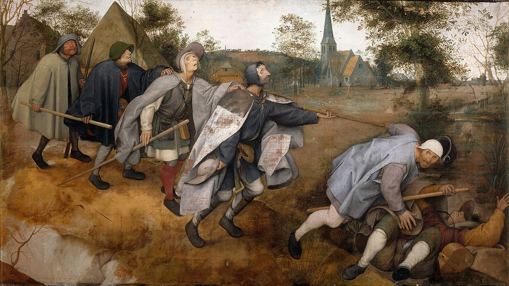

<figure style="margin-bottom: 3rem; text-align: center;">
  
</figure>

---

Hace tiempo escuché una frase del filósofo José Antonio Marina: “Todo el mundo tiene derecho a expresar su opinión, pero no toda opinión es respetable”.

Hoy en día parece que todas las opiniones tienen el mismo peso: las que están sustentadas por la evidencia y las que no. Esto nos lleva a desactivar la autoridad de la ciencia hasta el punto en el que “Pepe” tiene el mismo peso en cualquier mesa de debate que un científico experto en la materia.

¿Cómo narices hemos llegado hasta aquí? ¿Qué tiene que ver esto con la innovación?

Hay una frase, un lema más bien, que me llamó la atención desde el primer día que lo escuché: *“Nullius in verba”*. Un lema que expresa una idea un poco difusa pero con mucho sentido: no debes dar por válido lo que diga nadie, por muy experto que sea en una materia, hasta que no corrobores el proceso de hipótesis, testeo y resultado que le han llevado a esa conclusión.

Durante años, los miembros de la Royal Society de Londres hicieron de este lema un modo de entender el caos y la incertidumbre que les rodeaba. Estudiosos que entendían la importancia del camino, un proceso donde era clave establecer unas premisas iniciales que fuesen probadas como veraces o falsas tras la experimentación. Estos académicos sabían que un científico debe ser curioso y escéptico por naturaleza, y que esas cualidades eran, y siguen siendo, las que dan luz a nuevos descubrimientos y, sobre todo, a nuevas innovaciones.

Últimamente tengo la sensación de que este lema se ha llevado al extremo más oscuro, donde solo la primera parte de “no dar por válidas las palabras de nadie” tiene cabida en una sociedad que pone en duda toda opinión. Hemos perdido la fe en la ciencia.

No tengo muy claro qué es lo que realmente produce tanto rechazo ante cualquier descubrimiento científico, o simplemente ante cualquier dato obtenido por medio del proceso científico tradicional. Lo que sí tengo meridianamente claro es que este cambio de paradigma ha puesto en peligro la innovación de impacto.

Ya nada nos sorprende. Llevamos tantos años conviviendo con las aplicaciones de los grandes descubrimientos tecnológicos del siglo pasado que las tomamos como algo por supuesto. Las grandes figuras científicas como Einstein u Oppenheimer, en las que se basan de hecho muchas de las grandes innovaciones que seguimos usando en nuestro día a día, han dado paso a filántropos tecnológicos que solo buscan un beneficio económico.

Hace tiempo que la figura central dejó de ser el científico que sobrepasa los límites del entendimiento del mundo que nos rodea para realizar un descubrimiento; ahora es el CEO que lo comercializa globalmente.

Globalización… Ese concepto que tanto bien (y mal) ha traído al mundo.

En realidad, es esta hiperconectividad y este acceso inmediato a la información el causante de esta disonancia entre lo científico y lo profano. Ya no hace falta pasarte media vida estudiando un tema para hablar sobre él y convertirte en un referente que la sociedad respete.

“Todo el mundo tiene derecho a expresar su opinión”.

La globalización y la transmisión masiva de información han provocado una falsa equiparación de las opiniones. Todos los puntos de vista tienen el mismo peso en un espacio digital donde el anonimato abre las puertas a la evasión del juicio social que durante años nos ha hecho tener paciencia y ser cautos.

La ignorancia convertida en evidencia que soporta cualquier idea u opinión: esta es la mayor malversación de *Nullius in verba*.

Hemos literalizado la parte de “no dar por válidas las palabras de nadie” y nos hemos olvidado de la segunda parte. Nos hemos dejado en el tintero esa invitación a buscar una verdad sustentada en hechos. El problema es que muchos optan por el atajo cognitivo de buscar evidencia en la web y creen que sus opiniones se sustentan en hechos comprobados.

Con la llegada de la IA no vamos sino a agrandar la bola de nieve, tomando como dogma las respuestas de unos modelos de lenguaje que han sido entrenados con las falacias que llevan años inundando la web.

Aquí el problema: los que saben poco suelen gritar mucho.

La cantidad de información que tenemos a un clic de distancia, y que soporta hipótesis que no se han verificado, hace muchas veces imposible rebatir opiniones a personas que, paradójicamente, creen que su verdad es la única que existe.

Por eso, “no toda opinión es respetable”.

Y lo peor de todo es que nos olvidamos de que la ciencia es la madre de toda innovación. Sin científicos que cuestionen el *status quo*, sin cabezas pensantes que sigan ese *“Nullius in verba”*, estamos abocados a construir innovaciones soportadas por auténticos castillos de naipes. Estructuras tan frágiles como las opiniones de algunos.

Con esto quiero que te quedes con una idea: aunque a veces la duda es inevitable, el camino de la ciencia es el único que conduce a innovaciones que se recuerdan durante siglos.

  Imagen de cabecera: "La parábola de los ciegos" – Pieter Bruegel el Viejo (1568). Fuente: <a href="https://commons.wikimedia.org/w/index.php?curid=28885659" style="color: #999; text-decoration: underline;">Wikimedia Commons</a>.

